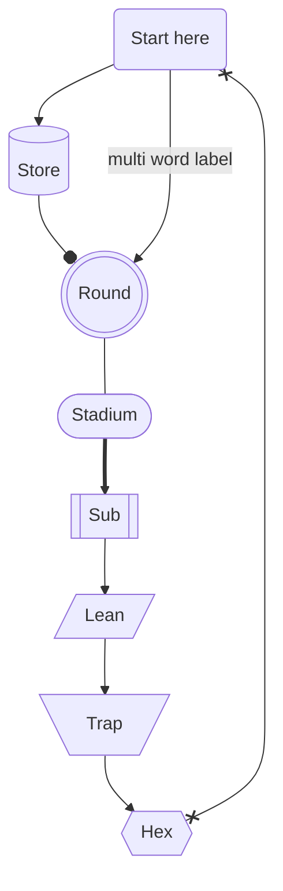

# Notes

Some prose with a `mermaid` word in it.

```mermaid
graph TD
  A@{ shape: rounded, label: "Start here" } --> B@{ shape: cyl, label: Store }
  B --o C(((Round)))
  C --- D([Stadium])
  D ==> E[[Sub]]; E --> F[/Lean/]
  F --> G[\Trap/]
  G --> H{{Hex}}
  A x--x H
  A -- multi word label --> C
```

~~~mermaid
sequenceDiagram
  Alice->>Bob: hi
~~~

Trailing text.
